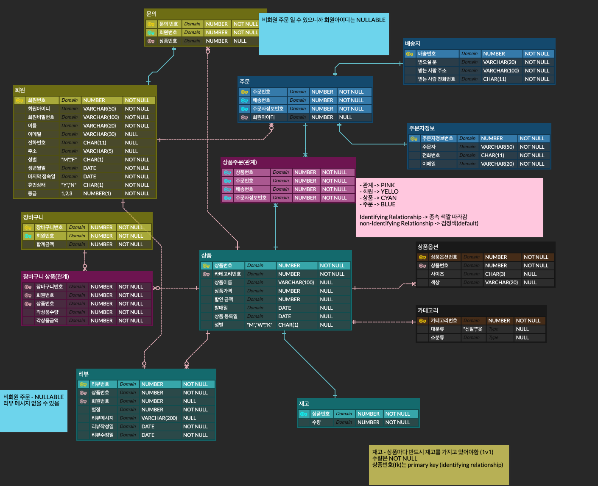

# 쇼핑몰 Web Application 개발

- 데이터베이스 교육에서 팀별로 설계한 쇼핑몰 ERD를 기반으로 Application을 구현합니다.
- 모든 기능은 Servlet/JSP 환경에서 구현합니다
- git clone 후 구현합니다.
- main branch를 기준으로 feature/{학번} branch를 생성하여 진행합니다.
    - ex) feature/JBGW04-001, feature/JBGW04-002, …
- 학번으로 생성한 branch를 origin에 push 합니다.(push는 2번이상 할 수 없습니다.)

---

## ERD

## 기술 스택

       

## 쇼핑몰 동작

| 메인화면 | 로그인 |
| --- | --- |
|  |  |

| 마이 페이지 | 상품 관리 |
| --- | --- |
|  |  |

### 기능 구현 정리 

[쇼핑몰구조](https://github.com/unggu0704/java-servlet-jsp-shoppingmall/blob/main/docs/%EC%87%BC%ED%95%91%EB%AA%B0%20%EA%B5%AC%EC%A1%B0.md)

### 동작

- **Java** 언어를 사용하여 **Servlet** - **JSP**를 이용한 쇼핑몰 웹 어플리케이션입니다.
- 빌드 도구는 **Maven** 을 사용했습니다.
- 서버는 **Apache Tomcat**을 사용합니다.

- **MVC 패턴**을 적용해 Model과 View, Controller를 분리했습니다.
    - **FrontController**를 활용해 공통 코드에 대해서 코드의 중복을 제거했습니다.
    - **FrontController** 에서 매번 Command 객체를 생성하는 것을 `Controller Factroy`와 `@WebServlet` 를 통한 맵핑으로 최적화했습니다.
    - **ViewResolver**는 `Controller(Command)` 가 반환하는 viewName을 `WEB-INF/views` 하위에 있는 JSP 파일로 대응하는 역할을 합니다.
    - **ViewResolver**에 의존하여 맵핑을 하여 JSP 파일의 위치가 WEB-INF/views에서 `WEB-INF/jsp` 로 변경이 되더라도 **ViewResolver**만 변경하면 됩니다.
    - **JSP** 파일은 view의 기능만 담당하기에 비즈니스 로직이 담기지 않도록 설정했습니다.
- **JDBC**를 활용하며 추가 요청이 필요할 때 연결을 재사용할 수 있도록 관리되는 **Connection Pool**을 **overhead**를 감소시키고 데이터베이스의 부하를 감소시켰습니다. (5로 설정)
    - **Connection**은 `ThreadLocal` 을 사용하여 관리합니다.
    - *과제에서는 여러 수강생이 원격에 연결하기 때문에 5로 설정해논 상태입니다.*
    - **Transaction** 은 에러 발생시 무조건 **Rollback** 하도록 설정했습니다.
- **Session** 을 사용하여 로그인된 사용자를 기억합니다.
    - **Filter**를 통해 관리자 세션과 유저 세션 그리고 로그인 유무의 유효성을 지속적으로 체크합니다.
- **UI**는 CSS 라이브러리인 *Bootstrap*을 사용했습니다.
